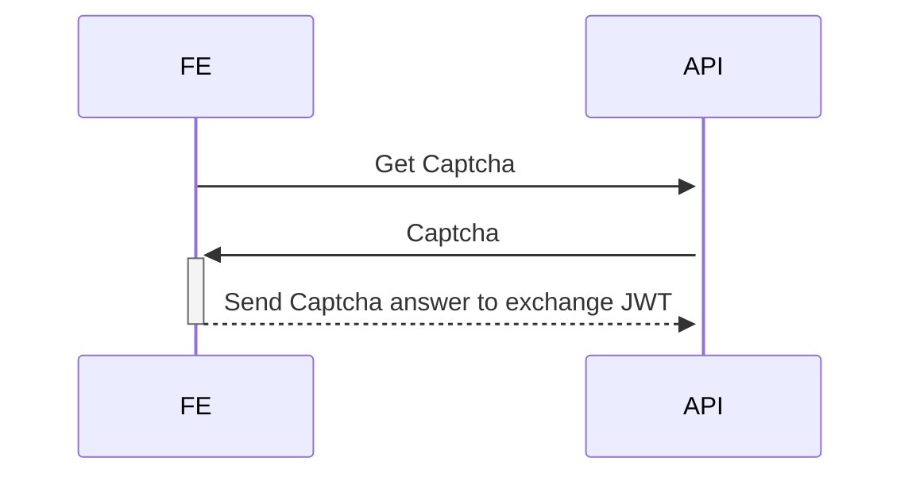

# Sample

https://hub.docker.com/r/genschsa/mysql-employees

# Todos

- security JWT token
- Logging with X-Request-ID

- GET /captchas
- POST /captchas
- GET /token
- GET /todos
- POST /todos
- PUT /todos:id
- DELETE /todos/:id
- GET /ping
- GET /ready

Authen Flow

